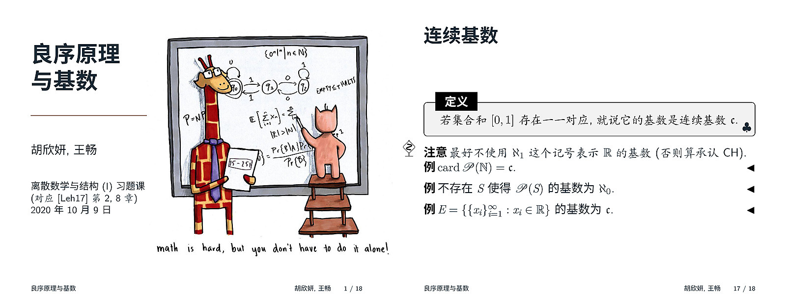
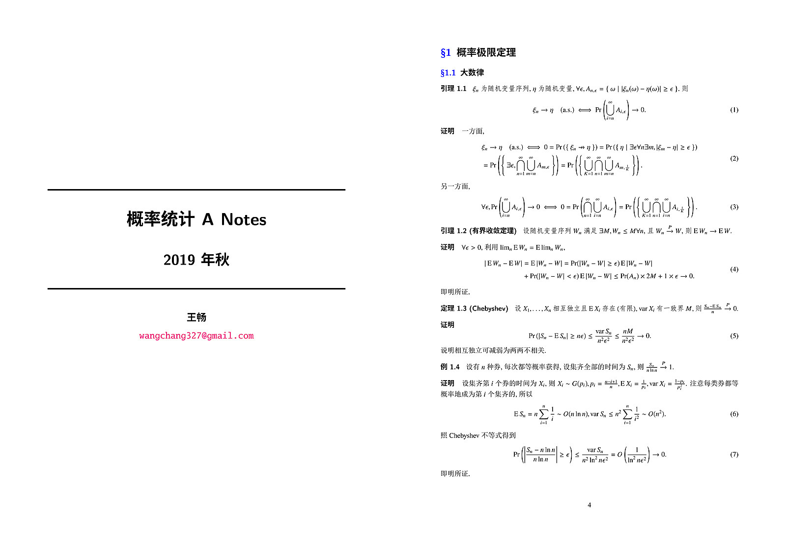
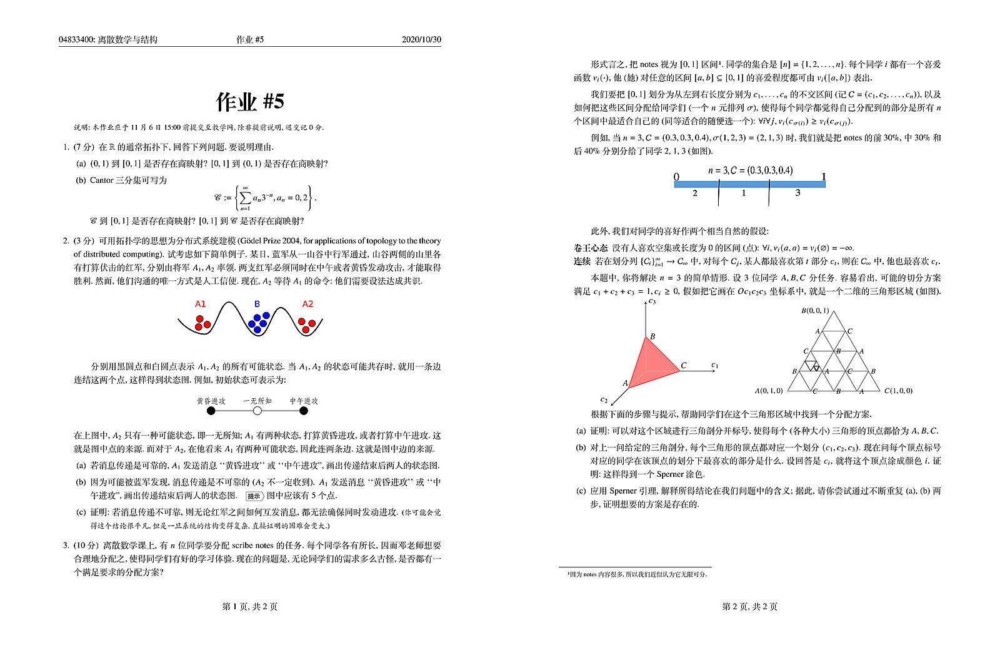
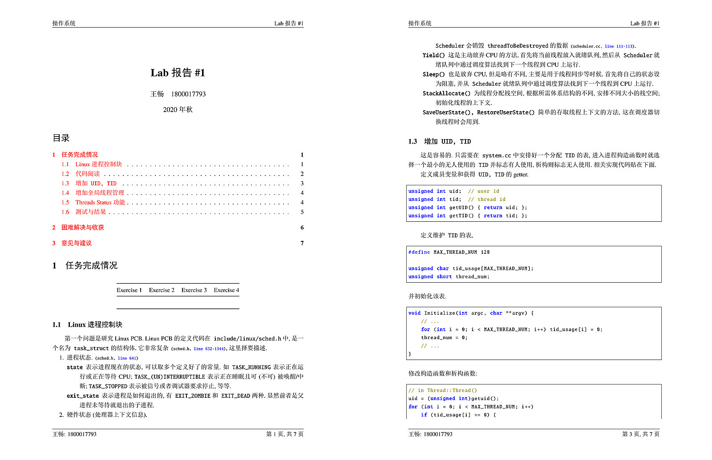
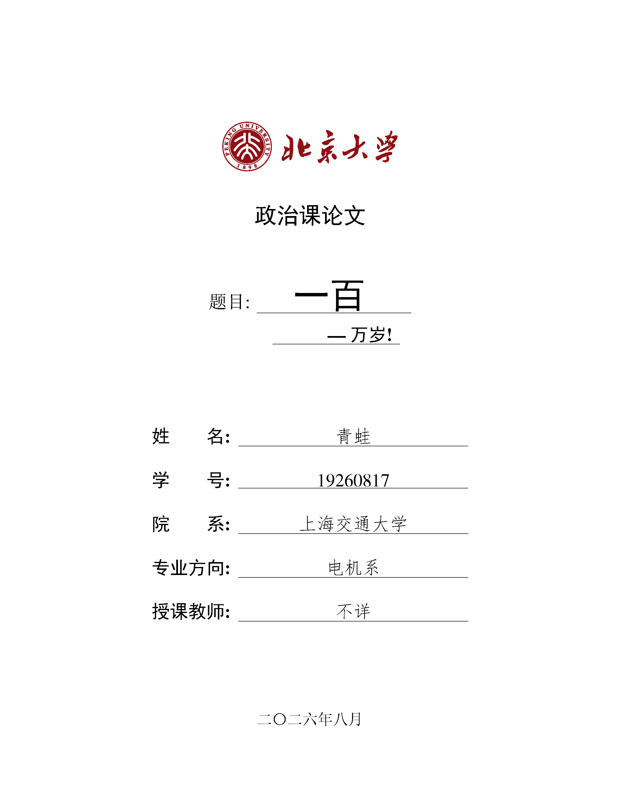

# LaTeX Templates - 日常事务 LaTeX 懒人包

[](https://www.latex-project.org/) [](https://GitHub.com/wangchang327/latex-templates/stargazers/)

整理了一些常用的 TeX 模板，欢迎切磋取用。因内容是逐渐积累而得，故代码风格和格式有所不同，敬请谅解。制作之基本标准是：简洁美观、功能齐全。其中，较为正式的 pre 和课程笔记均单独分离 ```sty``` 文件，而追求短平快的作业和报告则直接以 ```tex``` 形式提供。

* mathpre.sty：用于 presentation。
* notes.sty：用于 scribe notes 和汇编整理 notes。
* homework.tex：用于写作业。
* report.tex：用于写课程报告。

* pku-cover.tex：一个 snippet，生成 PKU 论文封面。

下面首先给出效果图，再给出用例及注意事项。

## 效果图

### ```mathpre.sty```




### ```notes.sty```



### ```homework.tex```



### ```report.tex```



### ```pku-cover.tex```



## 用例及注意事项

### ```mathpre.sty```

* 需要安装 Noto 系列中文字体，按[这里](https://github.com/googlefonts/noto-cjk)下载，也可以删掉文件中相应的设置。
* 定理环境须跟```{}{}```，与一般 ```amsmath/thm``` 的用法不同。引入这两个包会导致编译错误。
* BUGS：如果想要使用编号的定理环境，则不能制作动画，否则编号不对。

```latex
\documentclass[notheorems]{beamer} % 必须[notheorems], 否则与自定义的定理环境冲突
\usepackage{mathpre}

\title{西江月 \\ 证明}
\author{王畅}
\institute{加里敦大学}
\date{2333年2月33日}
\background{figures/15251.pdf}

\AtBeginSection{
    \begin{frame}<beamer>
        \frametitle{Outline}
        \tableofcontents[currentsection]
    \end{frame}
}

\begin{document}
    \maketitle
    \section{西江月·证明}

    \begin{frame}
        \frametitle{Cantor集}
        \begin{itemize}
            \item Cantor 是集合论的创始人.
            \[ \mathscr C := \left\{ \sum_{n=1}^\infty a_n 3^{-n}, a_n = 0, 2 \right\}. \]
        \end{itemize}
        \begin{theorem}{沃·兹基硕德, 1984}{}
            即得易见平凡, 仿照上例显然.
        \end{theorem}
        \begin{proof}
            留作习题答案略, 读者自证不难.
        \end{proof}
        \begin{note}
            反之亦然同理, 推论自然成立, 略去过程QED, 由上可知证毕.
        \end{note}
    \end{frame}

    \begin{frame}[plain]
        \addtocounter{framenumber}{-1}
        \begin{center}
            \Huge{\bf 谢谢聆听,请批评.}
        \end{center}
        \begin{figure}
            \centering
            \includegraphics[width=0.5\linewidth]{figures/dbd.pdf}
        \end{figure}
    \end{frame}

    \begin{frame}[plain,allowframebreaks]
        \frametitle{参考文献}
        \addtocounter{framenumber}{-1}
        \bibliographystyle{amsalpha}
        \bibliography{ref.bib}
    \end{frame}
\end{document}
```

### ```homework.tex```

* 作业和作业解答二合一，通过```\printanswers```控制是否打印解答。
* 其余用法请参看注释。

```latex
\documentclass{exam}
\usepackage{ctex}
\usepackage{amsmath}
\usepackage{amssymb}
\usepackage{amsthm}
\usepackage{mathrsfs} % 花写字母
\usepackage{xcolor}
\usepackage{paralist} % 扩展列表, 如紧凑列表
\usepackage{mathtools} % 一些额外符号
\usepackage{booktabs} % fancy表格
\usepackage{graphicx} % 图片和浮动
\usepackage{float}
\pointname{分}

% 页眉页脚
\pagestyle{headandfoot}
\firstpageheadrule
\firstpageheader{00000000: 肥宅导论}{作业 \#1}{2333/02/33} % 修改为作业布置的日期
\firstpagefooter{}{第 \thepage 页,共 \numpages 页}{}
\runningfooter{}{第 \thepage 页,共 \numpages 页}{}

\renewcommand{\solutiontitle}{\noindent{\heiti 解答:}\enspace} % 答案前面的提示词
\theoremstyle{remark}
\newtheorem*{remark}{评论}

\usepackage{tikz}
\usetikzlibrary{shapes.symbols}
\newenvironment{hint}{% 提示词绘制
    \ifvmode
        \ignorespaces
    \else
        \quad
    \fi
    \begin{tikzpicture}[baseline=(H.base), every node/.style={signal, draw, very thin, signal to=east, signal from=nowhere, signal pointer angle=120, inner sep=2pt}]
        \node[anchor=mid west] (H) at (0,0) {\heiti\footnotesize 提示};
    \end{tikzpicture}
}{}

% 字体更换
\usepackage{newtxtext}
\usepackage{newtxmath}
\DeclareSymbolFont{CMlargesymbols}{OMX}{cmex}{m}{n}
\let\sumop\relax\let\prodop\relax
\DeclareMathSymbol{\sumop}{\mathop}{CMlargesymbols}{"50}
\DeclareMathSymbol{\prodop}{\mathop}{CMlargesymbols}{"51}

\begin{document}
    \vspace*{0in}
    \begin{center}
        \Huge\bf 作业 \#1 % 修改为作业编号
    \end{center}
    
    \unframedsolutions % 取消答案的框
    \SolutionEmphasis{\fangsong} % 答案字体设置
    \printanswers % 打印答案, 布置作业时请注释掉
    
    {\small\kaishu 说明: 本作业不用交, 交了记0分.}

    % \question表示一个题
    % part和subpart用来分小问
    % solution用来写答案
    \begin{questions}
        \question[5] 解释你一天是如何达成肥宅目标的.
        \begin{solution}
            (留白)
        \end{solution}
        \begin{remark}
            留白, 充分显示了肥宅的本性.
        \end{remark}

        \question[5] 考虑算式 $1 + 2$.
        \begin{parts}
            \part[2] 请问它等于什么? \begin{hint} 答案不是3. \end{hint}
            \part[3] 解释你的答案.
        \end{parts}
        \begin{solution}
            \begin{parts}
                \part 答案为 $2 + 1$.
                \part 因为自然数的加法做成一个 Abel 群.
            \end{parts}
        \end{solution}
    \end{questions}
\end{document}
```

### ```notes.sty```

* 需要安装 Noto 系列中文字体，按[这里](https://github.com/googlefonts/noto-cjk)下载，也可以删掉文件中相应的设置。
* 有两种封面设置：```\fancycover[4]```用于汇编整理 notes，会自动生成单页封面及版权页；```\meta[2]``` 用于单次 scribe notes，只会生成类似 ```article``` 的标题。

```latex
\documentclass{scrartcl}
\usepackage{notes}
\begin{document}
    \fancycover{论打牌}{胡适}{北京大学}{hushi@pku.edu.cn}

    \section{打牌日记}
    \begin{compactenum}
        \item 7月4日 新开这本日记, 也为了督促自己下个学期多下些苦功. 先要读完手边的莎士比亚的《亨利八世》.
        \item 7月13日 打牌.
        \item 7月14日 打牌.
        \item 7月15日 打牌.
        \item 7月16日 胡适之啊胡适之! 你怎么能如此堕落! 先前订下的学习计划你都忘了吗? 子曰: ``吾日三省吾身.'' 不能再这样下去了!
        \item 7月17日 打牌.
    \end{compactenum}
    \begin{exercise}
        来书言有``无恒''之病, 此为今日通病, 不止弟一人而已也. 治之之法, 在于痛改. 其法大概如下: 一, 读书非毕一书勿读他书. 二, 每日常课之外, 须自定课程而敬谨守之. 三, 时时自警省.
        如懈怠时, 可取先哲格言如``人而无恒, 不可以作巫医(古谚)'', ``德不进, 学不勇, 只可责志(朱子)'', ``精神愈用则愈出(曾文正)''之类, 置诸座右, 以代严师益友, 则庶乎有济乎? 居此十日, 便仍归去. 适有去Cornell之志, 不知能实行否?
        \begin{hint}
            写得好.
        \end{hint}
    \end{exercise}
    \begin{theorem}[胡适, 年代不详]
        今为积极之进行次序曰: 第一, 卫生: 每日七时起. 每夜十一时必就寝. 晨起做体操半时. 第二, 进德: 表里一致 --- 不自欺. 言行一致 --- 不欺人. 对己与接物一致 --- 恕. 今昔一致 --- 恒. 第三, 勤学: 每日至少读六时之书. 读书以哲学为中坚, 而以政治, 宗教, 文学, 科学辅焉. 主客既明, 轻重自别. 毋反客为主, 须擒贼擒王. 读书随手作记.
    \end{theorem}
    \begin{proof}
        留作习题.
    \end{proof}
    
    \section{答案与提示}
    \makehints
\end{document}
```

### ```report.tex```

```latex
\documentclass{article}
\usepackage{ctex}
\usepackage{geometry}
\usepackage{amsmath}
\usepackage{amsthm}
\usepackage{amssymb}
\usepackage{mathtools}
\usepackage{mathrsfs}
\usepackage{natbib}
\bibliographystyle{abbrv}
\usepackage{lastpage}
\usepackage{paralist}
\usepackage{booktabs}
\usepackage[colorlinks]{hyperref}
\geometry{left=3.17cm, right=3.17cm, top=2.54cm, bottom=2.54cm} % A4纸
\usepackage{fancyhdr}
\usepackage{graphicx}
\usepackage{float}
\usepackage{xcolor}
\usepackage{listings} % 代码
\usepackage{newtxtext}
\usepackage{newtxmath}
% 替换部分符号
\DeclareSymbolFont{CMlargesymbols}{OMX}{cmex}{m}{n}
\let\sumop\relax\let\prodop\relax
\DeclareMathSymbol{\sumop}{\mathop}{CMlargesymbols}{"50}
\DeclareMathSymbol{\prodop}{\mathop}{CMlargesymbols}{"51}
% 代码高亮
\lstset{
    language=C++,
    numberstyle=\tiny,
    basicstyle=\small\ttfamily,
    stringstyle=\color{purple},
    keywordstyle=\color{blue}\bfseries,
    commentstyle=\color{olive},
    directivestyle=\color{blue},
    frame=single,
    rulesepcolor=\color{red!20!green!20!blue!20}
}
\usepackage{algorithm2e}

\title{\bfseries Lab报告 \#1}
\author{张三 \quad 2332332333}
\date{2333年冬}

\fancypagestyle{plain}{
    \lhead{睡觉实习}
    \chead{}
    \rhead{Lab报告 \#1}
    \lfoot{张三: 2332332333}
    \cfoot{}
    \rfoot{第 \thepage 页,共 \pageref*{LastPage} 页}
}

\renewcommand{\headrulewidth}{0.4pt}
\renewcommand{\footrulewidth}{0.4pt}

\begin{document}
    \maketitle
    \pagestyle{plain}
    \tableofcontents

    \section{睡觉算法}
    \begin{algorithm}[H]
        \SetKwFunction{g}{sleep}
        \SetKwProg{Fn}{Function}{:}{end}
        \Fn{\g{}}{
            \For{}{
                do nothing
            }
            \Return 0 \tcc*{never reaches}
        }
    \end{algorithm}

    \section{睡觉代码}
    \begin{center}
        \begin{lstlisting}
printf("sleep!")
while (1) sleep();
        \end{lstlisting}
    \end{center}
\end{document}
```

### ```pku-cover.tex```

* 若修改标题，需要手工调整部分下划线位置。

```latex
\documentclass{article}
\usepackage{ctex}
\usepackage{anyfontsize}
\usepackage{geometry}
\geometry{left=3.17cm, right=3.17cm, top=2.54cm, bottom=2.54cm} % A4纸
\usepackage{graphicx}
\usepackage{setspace}
\usepackage{float}
\usepackage{newtxtext}
\makeatletter
\newcommand\dlmu[2][4cm]{\hskip 1pt \underline{\hb@xt@ #1{\hss #2 \hss}} \hskip 3pt}
\makeatother
\begin{document}
    \thispagestyle{empty}
    \vspace*{1.0cm}
    \begin{figure}[ht]
        \centering
        \includegraphics[width=0.4\linewidth]{figures/pku.pdf}
    \end{figure}
    \begin{center}
        \huge{\textbf{政治课论文}}
    \end{center}
    \vspace*{1.5cm}
    \begin{center}
        \LARGE{题目:} \fontsize{36}{36}{\underline{\textbf{\quad 一百 \quad}}\\}
        \begin{spacing}{1.5}
            \LARGE{\leftline{\hspace{180pt}\textbf{\underline{\qquad\quad --- 万岁!\hspace{7pt}}}}}
        \end{spacing}
    \end{center}
    \vspace*{0.5cm}
    \begin{center}
        \begin{spacing}{2.0}
            \LARGE{
                \textbf{\heiti{姓\qquad 名: }}\fangsong{\dlmu[8cm]{青蛙}}\\
                \textbf{\heiti{学\qquad 号: }}\fangsong{\dlmu[8cm]{19260817}}\\
                \textbf{\heiti{院\qquad 系: }}\fangsong{\dlmu[8cm]{上海交通大学}}\\
                \textbf{\heiti{专业方向: }}\fangsong{\dlmu[8cm]{电机系}}\\
                \textbf{\heiti{授课教师: }}\fangsong{\dlmu[8cm]{不详}}\\
            }
        \end{spacing}
    \end{center}
    \vspace*{1.0cm}
    \begin{center}
        \Large{二〇二六年八月}
    \end{center}
    \newpage
    \clearpage
\end{document}
```

## License

[CC-BY-4.0](https://creativecommons.org/licenses/by/4.0/legalcode.zh-Hans)
