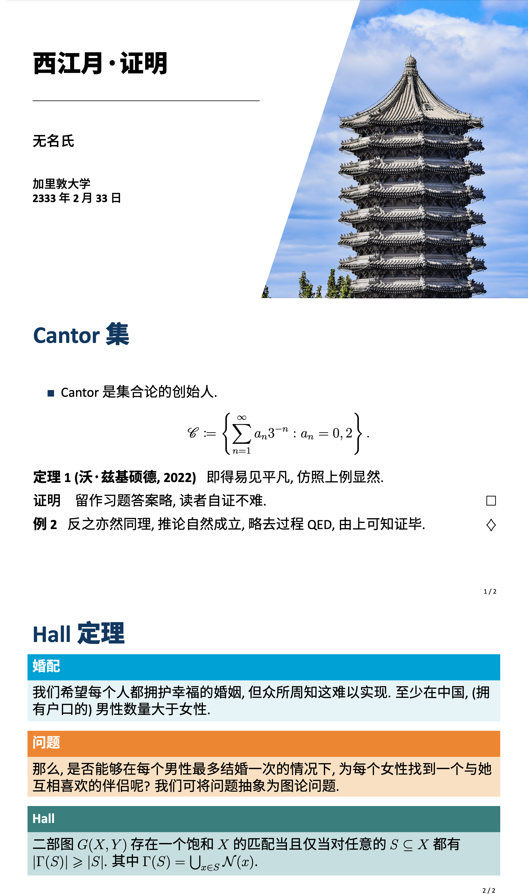
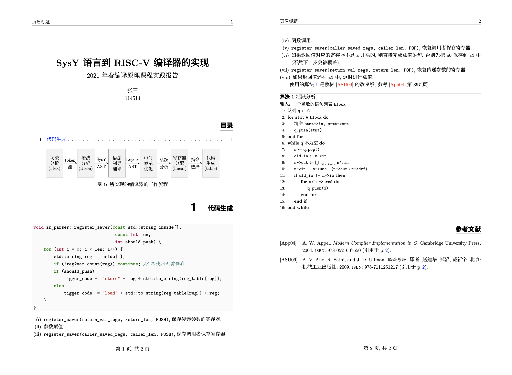
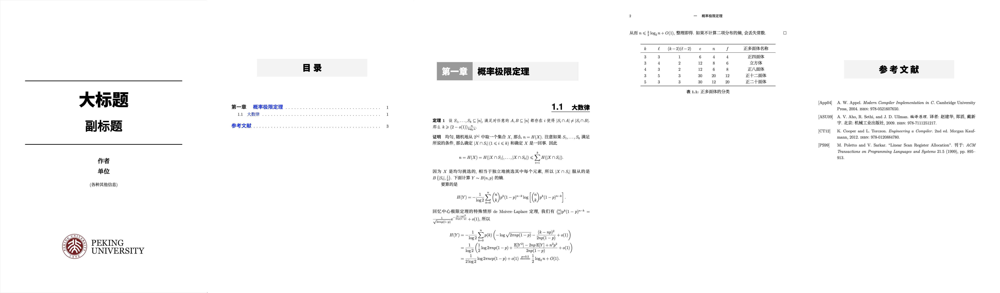
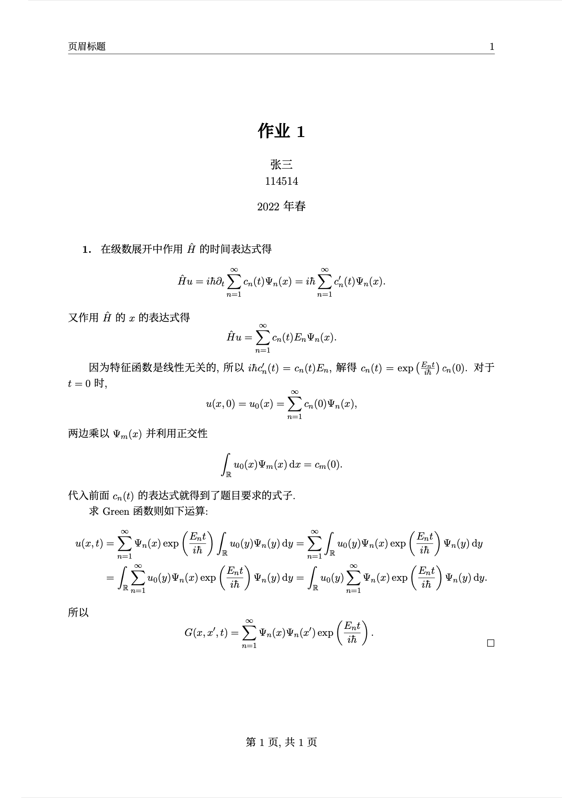
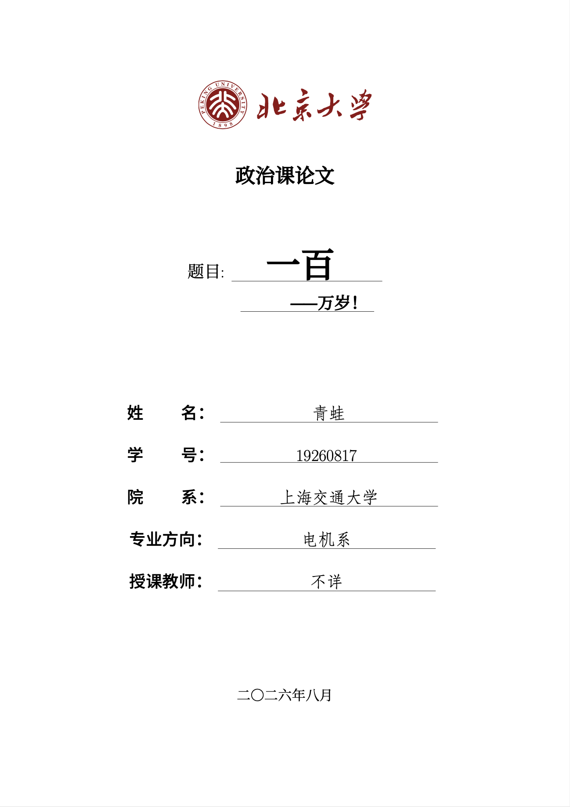

# LaTeX Templates - 日常事务 LaTeX 懒人包

[](https://www.latex-project.org/) [](https://GitHub.com/wangchang327/latex-templates/stargazers/)

更新：对写的 TeX 模板进行了整理，去掉了一些个人认为较为不妥的代码。

以下将各种代码片段根据功能分为多个可以直接使用和修改的便携的代码片段，其中均有注释，这样比较方便组合、持续使用和自定义，避免用到之后却无法根据自己的需求进行合理更改或者每次反复复制代码。——类似于一个“预训练模型”。

* algo-setup.sty：伪代码和代码
* beamer-setup.sty：投影片
* bib-setup.sty：参考文献
* font-setup.sty：字体和汉化
* general-cover.tex：一般的封面
* geometry-setup.sty：页面设置、页眉页脚和超链接
* list-setup.sty：列表环境
* math-setup.sty：公式和符号、定理环境、常用命令
* pku-cover.tex：类似政治课论文的封面
* science-setup.sty：物理、化学、<strike>音乐</strike>、<strike>扑克牌</strike>等
* tbfig-setup.sty：图和表
* tikz-setup.sty：TikZ 和 PGF 绘图
* title-setup.sty：章、节等标题的版式

以上各部分可以比较简单地组合使用，在 5 个 example 文件中附有例子，可以用来处理 pre、notes、课程报告、作业等。比如说直接列出

```latex
\documentclass[11pt]{article}
\usepackage{snippets/font-setup}
\usepackage{snippets/title-setup}
\usepackage{snippets/math-setup}
\usepackage{snippets/geometry-setup}
\usepackage{snippets/list-setup}
\usepackage{snippets/algo-setup}
\usepackage{snippets/tbfig-setup}
\usepackage{snippets/tikz-setup}
\usepackage{snippets/bib-setup}

\begin{document}
.......

```

就可以了。详情请点按代码查看（代码中的文字内容仅为示例）。

## 注意事项

1. 可能需要安装一些字体，如不需要，可自己改回 Fandol 等字体。
2. 各 snippets 的引入顺序尤其需要注意，之间存在依赖关系，如果次序不当则会发生编译错误（参看示例）。建议先后引入字体设置和数学环境设置。

## 效果图

投影片



报告



Notes



作业



政治课封面



## 致谢

有不少代码是我从[这里]()学到的，后者和本 repo 均使用 [CC-BY-4.0](https://creativecommons.org/licenses/by/4.0/legalcode.zh-Hans) 协议。[博雅塔的背景图](background.jpg)来自肥猴，此处仅为演示用途，勿作他用。
